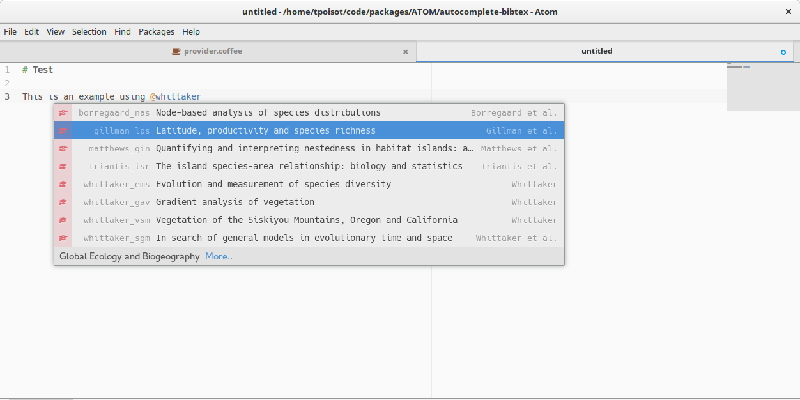

# Autocomplete-bibtex

Adds citation key autocompletion to
[autocomplete+](https://github.com/atom/autocomplete-plus) for
[Atom](http://atom.io/). Supports bibtex and citeproc (yaml) file formats.

## Screenshot



## Features

- Uses `autocomplete-plus` API v.2
- Sorts matches by score *then* by first author name
- Gives contextual information (container, volume, URL) in the completion pane
- Works on bibtex and citeproc format
- Articles, books, chapters, ..., have different colors
- Custom icon!

## Installation

You can install autocomplete-bibtex using the Preferences pane.


## Usage

1. Add an array of the files you want to search for citation keys to
  `config.cson`. Valid extensions are `bib`, `json`, and `yaml`.

  ```coffeescript
  'autocomplete-bibtex':
    'bibtex': [
      '/path/to/references.bib'
      '/path/to/references.json'
    ]
  ```

  (For instructions about editing `config.cson`, check out the Atom
  [documentation](https://atom.io/docs/latest/customizing-atom#advanced-configuration).)

  If you prefer a graphical user interface, you can add edit the settings directly in `Packages - Settings View - Manage Packages - autocomplete-bibtex` as shown in the illustrated screenshot below:

  

2. By default, the autocomplete-bibtex package is configured to provide
  suggestions in [scopes](https://atom.io/docs/latest/advanced/scopes-and-scope-descriptors)
  which Atom recognizes as Markdown.

3. In the document in which you want a citation, type '@' (the beginning of a
  Pandoc citation) and then begin to type the family name of any of the authors
  of the work you wish to cite. For instance, to cite

  > Krijnen, J., Swierstra, D., & Viera, M. O. (2014). Expand: Towards an
  > Extensible Pandoc System. In M. Flatt & H.-F. Guo (Eds.), Practical Aspects
  > of Declarative Languages (pp. 200–215). Springer International Publishing.
  > Retrieved from http://link.springer.com/chapter/10.1007/978-3-319-04132-2_14

  type the beginning of `@krijnen`, `@swierstra`, or `@viera`. (The search is
  not case sensitive, so `@Krijnen` or even `@KRIJNEN` will also work.)

  A list of possible works will display as soon as you type `@` and will filter
  as you continue to type. Select the work you desire from the list, hit `tab`
  to autocomplete, and the citation will be added for you.

  For instance, given a BibTeX entry like this

  ```tex
  @incollection{krijnen_expand_2014,
  	series = {Lecture Notes in Computer Science},
  	title = {Expand: Towards an Extensible Pandoc System},
  	copyright = {©2014 Springer International Publishing Switzerland},
  	isbn = {978-3-319-04131-5, 978-3-319-04132-2},
  	shorttitle = {Expand},
  	url = {http://link.springer.com/chapter/10.1007/978-3-319-04132-2_14},
  	abstract = {The Pandoc program is a versatile tool for converting between document formats. It comes with a great variety of readers, each converting a specific input format into the universal Pandoc format, and a great variety of writers, each mapping a document represented in this universal format onto a specific output format. Unfortunately the intermediate Pandoc format is fixed, which implies that a new, unforeseen document element cannot be added. In this paper we propose a more flexible approach, using our collection of Haskell libraries for constructing extensible parsers and attribute grammars. Both the parsing and the unparsing of a specific document can be constructed out of a collection of precompiled descriptions of document elements written in Haskell. This collection can be extended by any user, without having to touch existing code. The Haskell type system is used to enforce that each component is well defined, and to verify that the composition of a collection components is consistent, i.e. that features needed by a component have been defined by that component or any of the other components. In this way we can get back the flexibility e.g. offered by the packages in the {\textbackslash}{LaTeX}{\textbackslash}mbox\{{\textbackslash}{LaTeX}\} package eco-system.},
  	language = {en},
  	number = {8324},
  	urldate = {2014-07-23},
  	booktitle = {Practical Aspects of Declarative Languages},
  	publisher = {Springer International Publishing},
  	author = {Krijnen, Jacco and Swierstra, Doaitse and Viera, Marcos O.},
  	editor = {Flatt, Matthew and Guo, Hai-Feng},
  	month = jan,
  	year = {2014},
  	keywords = {Attribute Grammars, Document Formatting, Haskell, Logics and Meanings of Programs, Pandoc, Parsing, Programming Languages, Compilers, Interpreters, Programming Techniques, Software Engineering, Type System},
  	pages = {200--215},
  }
  ```
  typing `@krijnen` and hitting `tab` (assuming this is the only work by Krijnen
  in the selected BibTeX files) would yield

  ```markdown
  @krijnen_expand_2014
  ```
4. You can also search through citations using the `autocomplete-bibtex:search` command

### Custom citation formatting.

As of version 0.3.0, you can customize what autocomplete-bibtex inserts when you
confirm an autocomplete suggestion.

By default, autocomplete-bibtex inserts a
[Pandoc-style](http://johnmacfarlane.net/pandoc/README.html#citations)
citation (e.g., `@krijnen_expand_2014` from the example above). However, if you
prefer a different insertion, say a LaTeX footnote citation like
`\footfullcite{krijnen_expand_2014}`, you can adjust the `resultTemplate`
configuration variable in the package preferences or add another key to
`config.cson`.

```coffeescript
'autocomplete-bibtex':
  'bibtex': [
    '/path/to/references.bib'
  ]
  'resultTemplate': '\footfullcite{[key]}'
```

Autocomplete-bibtex will replace the string `[key]` with the key of the BibTeX
entry you select using the autocomplete feature.

N.B. Even if you use a custom citation format, the autocompletion feature is
still triggered by typing `@` and then part of an author’s name.

## Acknowledgements

Many thanks to those few developers who work tirelessly to improve
[autocomplete-plus](https://github.com/atom-community/autocomplete-plus).
Without their hard work and support, this package could not exist.
